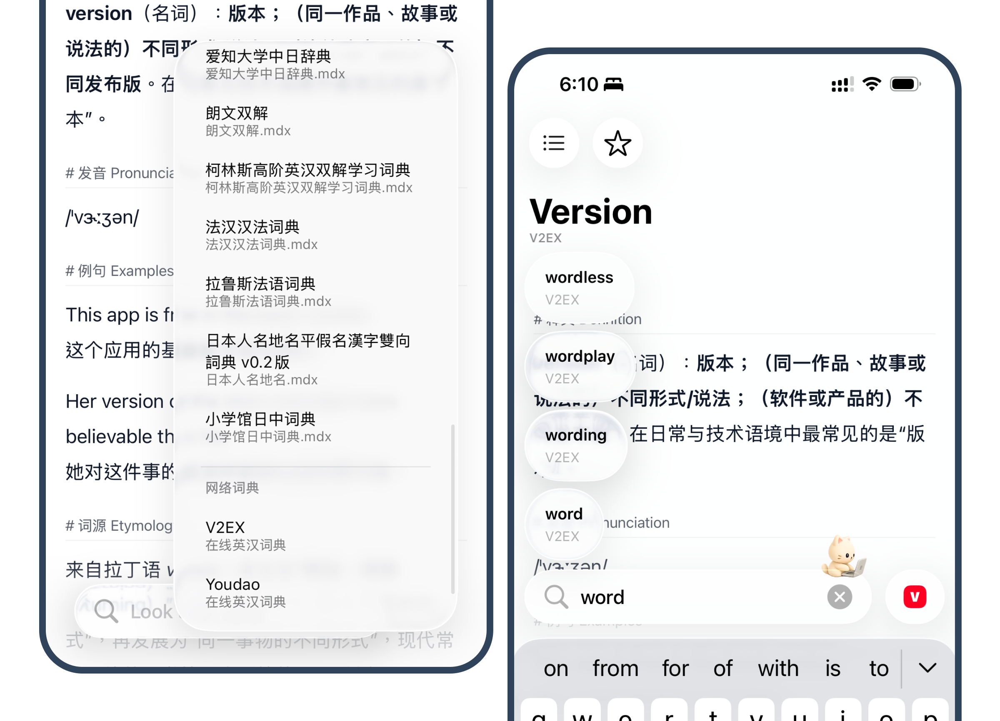
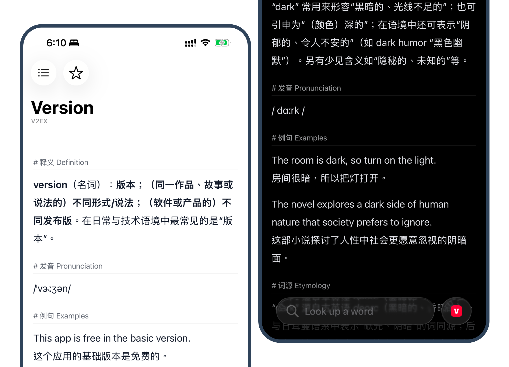
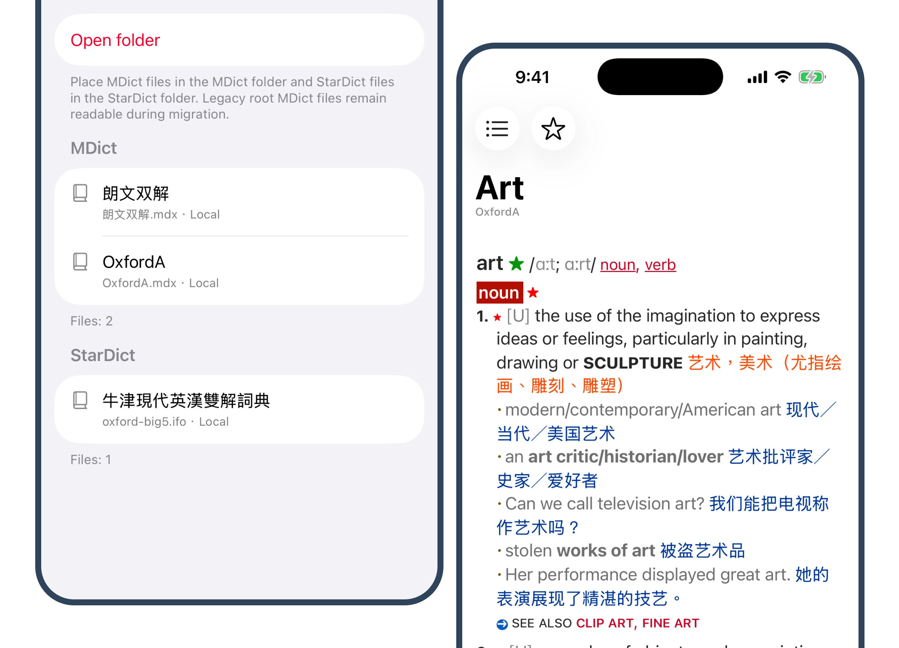
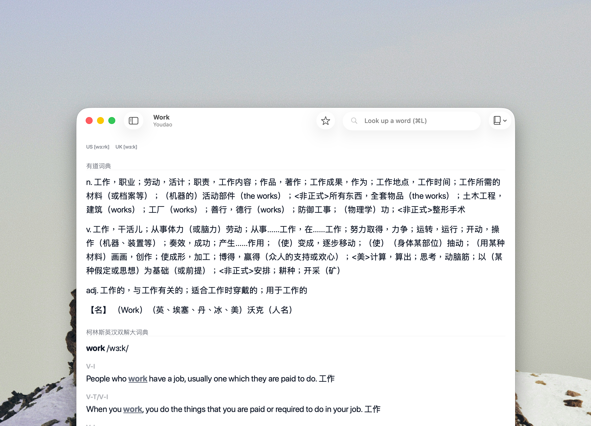

# 小众软件论坛 Draft

Target: 小众软件官方论坛

Recommended first category while aDict 3.0 is still in TestFlight: `讨论分享` or `讨论分享 > alpha`.

Live/publishing reference:

- Forum: <https://meta.appinn.net/>
- Account: <https://meta.appinn.net/u/qoli/activity/topics>
- Discovery channel rules: <https://meta.appinn.net/t/topic/43728>
- Previous aDict post from 2021: <https://meta.appinn.net/t/topic/23723>
- Previous aDict post from 2019: <https://meta.appinn.net/t/topic/12608>
- Submitted pending review on 2026-05-20: pending post id `32469`, category `讨论分享`.
- Feedback topic on 2026-05-21: <https://meta.appinn.net/t/topic/85668>. Appinn said product recommendation posts should be submitted to `发现频道` and follow the discovery template.
- Discovery channel template: <https://meta.appinn.net/t/topic/77583>

## Positioning

This draft is written as a developer self-recommendation for 小众软件 users who like practical, lightweight, niche tools. It should introduce aDict as an app that works out of the box with online dictionaries first, then mention local MDict / StarDict files as an advanced capability.

Because aDict 3.0 is still a TestFlight build, do not submit it to `发现频道` first. 小众软件's own rules say testing content should go to `讨论分享`, and mobile apps submitted to `发现频道` should provide an App Store link. After the App Store update is live, create a shorter `发现频道` version.

## Suggested Title

```text
开发者自荐：aDict 3.0，一个 iPhone、iPad、Mac 上的轻量查词工具
```

Alternatives:

- aDict 3.0：一个开箱即用，也支持本地词典文件的 Apple 平台词典工具
- aDict 3.0：把本地 MDX / StarDict 词典留在 Apple 设备上的小工具
- 做了一个 iOS / macOS 词典工具，支持在线词典和本地词典文件

## Discovery Channel Template Draft

This version follows the official `发现频道模板` after Appinn feedback.

```markdown
## 软件名称

aDict 3.0

## 应用平台

iOS / iPadOS / macOS

目前 3.0 版本在 TestFlight 测试中，App Store 页面仍是已上架旧版信息。

## 推荐类型

【开发者自荐】

## 一句简介

一个 iPhone、iPad、Mac 上的轻量查词工具，支持在线词典来源，也支持导入本地 MDict / StarDict 词典文件。

## 应用简介

大家好，我是 aDict 的开发者。之前在小众软件论坛分享过 aDict 的旧版本，这次把这个老项目重新整理成了 3.0，所以按发现频道模板再来做一次开发者自荐。

aDict 是一个 Apple 平台上的查词工具。新版的目标不是做一个很重的词典资料库，而是提供一个尽量轻的查词入口：打开 app，输入单词，就可以用在线词典来源查询；如果你手里也有本地词典文件，也可以把它们接进同一个查词流程里。

目前测试版主要支持：

- 在线词典来源，例如 Youdao、V2EX Dict
- 多个词典来源切换
- 输入时的词条提示
- 查询历史和收藏
- iPhone / iPad / Mac
- 本地词典文件管理
- MDict / MDX / MDD
- StarDict

所以 aDict 3.0 不是只能给本地词典玩家使用。第一次打开时，可以先把它当成一个普通查词工具，用内置在线来源完成日常查询；如果之后需要更固定、更个人化的词典资料，再把自己的本地词典文件放进来。

本地词典这部分目前支持两种常见整理方式。可以把 `.mdx` 以及同名的 `.mdd`、`.css`、`.js` 放在 `MDict` 文件夹里，也可以把一本词典放在单独文件夹里。StarDict 也支持直接文件组和单独文件夹。

3.0 里也加了一个 Apple 智能相关的早期实验功能：在查词结果之外，用本地生成能力补充一些可配置内容，例如例句、用法说明、相关语境等。这个功能刚开发，还在收集意见，现在看到的规则、界面和生成结果都不代表正式版本。

如果你需要一个 Apple 平台上的轻量查词工具，欢迎试用。也欢迎直接指出哪些地方不像一个顺手的日常工具：比如在线来源是否够用、查询结果是否好读、历史和收藏是否方便、本地词典导入是否绕。

## 官方网站

介绍页：

https://adict.ronniewong.cc/

TestFlight：

https://testflight.apple.com/join/dCGMvyw9

App Store 页面：

https://apps.apple.com/in/app/adict-dictionary-lookup/id1483402597

提示：3.0 目前还是 TestFlight 测试版，还没有发布正式 App Store 更新。TestFlight 页面可能会显示已经上架版本的 App Store 信息，安装测试版之后才会拿到 3.0 build。
```

## Draft

大家好，我是 aDict 的开发者。之前在小众软件论坛发过两次 aDict 的旧版本，这次是把这个很久以前做的词典 app 重新整理成了 3.0，目前进入 TestFlight 测试阶段，所以再来做一次开发者自荐。

aDict 是一个 iPhone、iPad、Mac 上的查词工具。新版的目标不是做一个很重的词典资料库，而是提供一个尽量轻的查词入口：打开 app，输入单词，就可以用在线词典来源查询；如果你手里也有本地词典文件，也可以把它们接进同一个查词流程里。

我自己做这个工具的原因很简单：平时在手机、iPad 或 Mac 上读东西，遇到一个词时，希望能很快查一下，而不是先想应该打开哪个网站、哪个词典、哪个工具。aDict 3.0 里我先放进了一些可以直接使用的在线来源，例如 Youdao 和 V2EX Dict，也保留了查询历史、收藏和多个来源切换。

目前测试版主要支持：

- 多个词典来源切换
- 输入时的词条提示
- 在线词典来源，例如 Youdao、V2EX Dict
- 查询历史和收藏
- iPhone / iPad / Mac
- 本地词典文件管理
- MDict / MDX / MDD
- StarDict

所以 aDict 3.0 不是只能给本地词典玩家使用。第一次打开时，可以先把它当成一个普通查词工具，用内置的在线来源完成日常查询；等到需要更固定、更个人化的词典资料时，再把自己的本地词典文件放进来。

这次接入的在线来源里也包括 V2EX Dict。我把它放在一个独立来源里，用来补充常规释义之外的语境信息。实际查词时，你可以在不同来源之间切换：有些词适合看简洁释义，有些词则需要例句、词源或相关表达来帮助理解。



下面是深色和浅色下的查词显示效果：



另外，3.0 里我也刚加了一个 Apple 智能相关的实验功能：在查词结果之外，用本地生成能力补充一些可配置的内容，例如例句、用法说明、相关语境等。它不是替代词典释义，而是更像一个可以按规则追加的阅读辅助层。

这个功能还很新，目前主要是想看看它在真实查词场景里有没有价值，所以现在截图里看到的规则、界面和生成内容都不代表正式版本。


对本地词典用户，aDict 目前也支持：

- MDict / MDX / MDD
- StarDict
- 同名资源文件识别
- 一个词典一个文件夹的整理方式
- 本地词典来源切换
- iPhone / iPad / Mac

目前 MDict 这边支持两种常见整理方式。可以把同名资源文件直接放在一起：

```text
MDict/
  OxfordA.mdx
  OxfordA.mdd
  OxfordA.css
  OxfordA.js
```

也就是 `.mdx` 以及同名的 `.mdd`、`.css`、`.js` 会被识别为同一组词典资源。

也可以把一本词典放在单独文件夹里：

```text
MDict/
  OxfordA/
    OxfordA.mdx
    OxfordA.mdd
    OxfordA.css
    OxfordA.js
```



适合试用的人大概是：

- 平时会在 iPhone、iPad 或 Mac 上阅读英文/外文内容；
- 希望有一个轻量、直接可用的查词入口；
- 想把在线词典、本地词典、历史和收藏放在一个 app 里；
- 手里已经有 MDX / MDD / StarDict 文件，或者以后可能会用；
- 不介意测试版还有不完整的地方；
- 愿意指出具体使用体验、导入方式或显示效果上的问题。

Mac 版也使用同一套词典来源和查词流程：



介绍页：

https://adict.ronniewong.cc/

TestFlight：

https://testflight.apple.com/join/dCGMvyw9

3.0 目前还在 TestFlight 阶段。TestFlight 页面可能会显示已经上架版本的 App Store 信息，安装测试版之后才会拿到 3.0 build。

App Store 页面：

https://apps.apple.com/in/app/adict-dictionary-lookup/id1483402597

如果你需要一个 Apple 平台上的轻量查词工具，欢迎试一下。也欢迎直接指出哪些地方不像一个顺手的日常工具：比如在线来源是否够用、查询结果是否好读、历史和收藏是否方便、本地词典导入是否绕。对我来说，这个测试版最有价值的反馈，是它离「打开就能查、长期用也不碍事」还有多远。

## Image Notes

Images are already integrated into the draft body for preview:

1. `assets/freemdict-dictionary-menu-suggestions.png`: shows source switching and autocomplete.
2. `assets/freemdict-dark-light.png`: shows readable lookup results in dark/light modes.
3. `assets/appinn-apple-intelligence-enrichment.png`: shows the experimental Apple Intelligence enrichment feature.
4. `assets/freemdict-mdict-management.png`: shows dictionary file management and MDict lookup.
5. `assets/freemdict-macos.png`: shows macOS support.

The hero image is intentionally omitted from this draft because 小众软件 users usually prefer product UI over marketing visuals.

## Publishing Notes

- 2026-05-20: Submitted to `讨论分享` through the logged-in Arc session for `qoli`. Appinn accepted the request but returned `{"action":"enqueued","success":true,"pending_count":1}`, so the post is in moderation/pending review and does not yet have a public topic URL.
- 2026-05-21: Appinn created feedback topic <https://meta.appinn.net/t/topic/85668>. Reason: product recommendation posts should be posted to `发现频道` and follow the `发现频道模板` at <https://meta.appinn.net/t/topic/77583>. Use the `Discovery Channel Template Draft` above for resubmission.
- 2026-05-21: Resubmitted to `发现频道` with the template draft. Appinn accepted the request but returned `{"action":"enqueued","success":true,"pending_count":1}`; pending post id is `32499`, so it is still waiting for moderation and has no public topic URL yet.
- Uploaded forum images:
  - `freemdict-dictionary-menu-suggestions.png` -> `upload://76p8kFZqzMb7BBwJ7TO4Sgu64BO.jpeg`
  - `freemdict-dark-light.png` -> `upload://t1WROlbhmDAAAAzcuIgGh8gKenw.jpeg`
  - `appinn-apple-intelligence-enrichment.png` -> `upload://4DNyZ8h1GP7vns3srT17Go24PvX.jpeg`
  - `freemdict-mdict-management.png` -> `upload://zI2gB2hft9vjk40sYY3MWK9tXR6.jpeg`
  - `freemdict-macos.png` -> `upload://by9eODafeySaiE9gE71A0uZ8h0e.jpeg`
- Keep this as a testing/discussion post while 3.0 is on TestFlight.
- Do not post the same content to `发现频道` until the App Store version is updated.
- If posting to `发现频道` later, shorten the body and put App Store first, TestFlight second or omit TestFlight.
- Do not claim bundled dictionary resources.
- Lead with online dictionaries and out-of-box lookup; keep MDict / StarDict as advanced support.
- Describe Apple Intelligence enrichment as a newly developed experimental capability; do not imply the current UI or output is final.
- Do not ask users to leave email addresses in replies.
- If users ask about price, answer directly and separate current TestFlight behavior from future App Store plans.
