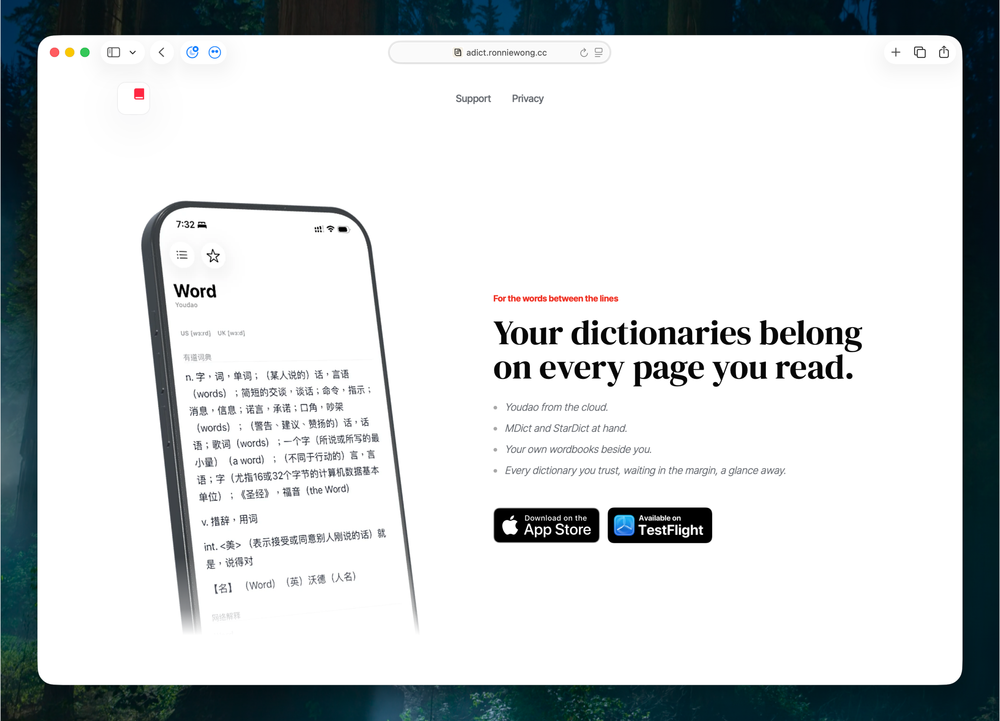

# FreeMdict Topic 44065

Live topic: <https://forum.freemdict.com/t/topic/44065>

Category: 软件经验交流展望

Title:

```text
做了一个支持 MDict / StarDict 的 iOS / macOS 词典 app：aDict 3.0
```

## Published Post Body

大家好，我最近把一个老项目 aDict 重写了一版，想放到这里听听词典用户的意见。

aDict 最早在 2019 年上架，当时主要是我自己用来查词。后来项目放了很久。这次重写之后，我把它重新定位成一个 iPhone / iPad / Mac 上的词典工具，重点不是内置多少内容，而是让本地词典文件和在线来源能在同一个查词流程里使用。

最近有一位用户向我提了一个需求：希望 aDict 支持多个词典联合查询。

这个需求表面上看是「一次查多本词典」，但实际会牵涉到输入提示、自动完成、词典来源排序、结果合并方式，以及本地 MDX / StarDict 和在线来源之间的优先级。所以我现在还没有直接把它完整做进去，想先听听长期使用多本词典的人会怎么设计这个功能。

目前重写版主要支持：

- MDict / MDX / MDD
- StarDict
- 本地词典文件管理
- 多个词典来源切换
- 输入时的词条提示
- 在线词典来源，例如 Youdao、V2EX Dict
- iPhone / iPad / Mac

我自己一直有一个需求：读东西时不想只依赖一个在线词典，也不想把以前收集的 MDX / MDD / StarDict 文件丢掉。以前这些词典文件通常只能留在某几个固定工具里使用，换到手机、平板或 Mac 上就会有割裂感。所以这次重写 aDict 时，我优先做的是「能不能把这些词典来源放到一个简单的查词入口里」。

下面这张是词典来源切换和输入提示。这里能看到本地 MDX 词典、V2EX、Youdao 等来源可以并列存在，输入时也会给出候选词。


本地词典这部分目前还比较基础，但已经可以管理 MDict / StarDict 文件，并用本地 MDX 做查询。下面左侧是词典文件管理，右侧是 MDict 词典查询结果。


Mac 版也可以使用同一套词典来源。我的目标不是做一个很复杂的资料库，而是让查词这件事在手机和 Mac 上都尽量轻。


这次也尝试接入了一些在线词典来源。比如 V2EX Dict 的内容形式和传统词典不太一样，除了释义和音标，也有例句、词源、相关词和语境补充。我觉得它适合作为一个独立在线来源，而不是替代本地词典。

这里是深色和浅色下的显示效果：


回到「多词典联合查询」这个需求，我现在比较不确定的是：

1. 多词典查询应该是「同时查所有已启用词典」，还是「先用当前词典做输入提示，提交后再查多本」？
2. 自动完成候选词应该来自哪里？当前词典、全部本地词典，还是最近常用的几个词典？
3. 多本词典都有结果时，应该合并在同一页，还是按词典分段 / Tab 展示？
4. 本地 MDX / StarDict 和在线词典来源应该混在一起查，还是分开查询？
5. 对 MDX / MDD / CSS / JS 的支持，哪些部分最影响这种联合查询的实际可用性？

我也做了一个简单的介绍页：[aDict Landing Page](https://adict.ronniewong.cc/)。



目前这个版本还在 TestFlight 阶段，功能仍然比较阳春。如果你也需要一个可以接入 MDict、StarDict 和在线词典来源的查词工具，欢迎试用，也欢迎直接指出现在的设计不合理之处。对我来说，这个版本最需要的不是夸奖，而是真正使用本地词典文件的人帮忙指出边界和坑。

提示：aDict 3.0 目前是 TestFlight 测试版，还没有发布到 App Store。TestFlight 页面里显示的 App Store 信息可能仍然来自已经上架的旧版；通过下面的 TestFlight 链接加入测试并安装后，才会看到 3.0 测试版。

TestFlight：[https://testflight.apple.com/join/dCGMvyw9](https://testflight.apple.com/join/dCGMvyw9)

Landing Page：[https://adict.ronniewong.cc/](https://adict.ronniewong.cc/)

## Reply Log

### Post 2: YYDWHY asked how to find the TestFlight build

Published reply:

```text
是我原帖没有说明清楚：aDict 3.0 现在还是 TestFlight 测试版，还没有发布 App Store 更新。

你可以直接点原帖里的 TestFlight 链接加入测试；TestFlight 页面上如果看到的是已经上架的商店信息，那部分可能仍然是旧版 App Store 信息，不代表 3.0 已经在商店发布。加入测试并安装后，才会拿到 3.0 的测试 build。
```

Future wording note: prefer "TestFlight shows existing App Store metadata" over repeating "原帖没有说明清楚" unless that is truly the best tone.

### Post 4: alipay said the app looks good after trying it

No separate reply was published before the file was created. A concise future reply could be:

```text
谢谢试用。如果后面遇到具体的 MDX / StarDict 显示问题，也欢迎直接贴出来，我会按真实词典文件场景去改。
```

### Post 5: alipay asked whether only single MDX files are supported

Published reply:

````text
目前支持的是同名资源文件放在一起的结构，例如：

```text
MDict/
  OxfordA.mdx
  OxfordA.mdd
  OxfordA.css
  OxfordA.js
```

也就是 `.mdx` 以及同名的 `.mdd`、`.css`、`.js` 会被识别为同一组词典资源。

你提到的文件夹形式确实是我考虑不周。目前还不支持把一本 MDict 词典放在单独文件夹里，例如 `MDict/OxfordA/OxfordA.mdx` 这种结构。这个使用方式很合理，后续版本我会更新支持这种文件夹放入/识别方式。
````

Follow-up status: this was fixed in the later 3.0 beta build. Current guidance can mention both same-name resources and one-dictionary-per-folder layouts.

### Post 7: Babelmind asked how to load local dictionaries when only the iCloud Drive aDict folder is visible

Published reply as post 8 on 2026-05-21:

````text
可以在 aDict 里面先到设置里的 **Dictionary Files**，点 **Open folder**，让系统直接打开当前实际读取的目录。

现在这部分有两种位置：

- 如果开启了 **Sync with iCloud**，词典会从 iCloud Documents 里读取；
- 如果关闭 **Sync with iCloud**，词典会从本机 Local Documents 里读取。

所以如果你现在只在 iCloud Drive 里看到 aDict 文件夹，通常可以直接把词典放到那个目录下；如果你想放本机目录，可以先在 aDict 里关掉 iCloud sync，然后再点 Open folder。

目前推荐的结构是：

```text
MDict/
  OxfordA.mdx
  OxfordA.mdd
  OxfordA.css

MDict/
  OxfordA/
    OxfordA.mdx
    OxfordA.mdd
    OxfordA.css

StarDict/
  Sample.ifo
  Sample.idx
  Sample.dict
```

放进去之后回到 aDict 的 Dictionary Files 页面刷新/重新进入，应该就能扫到。

这个地方现在确实不够直观，特别是 iOS 文件 App 里 iCloud / 本机目录的显示很容易让人误解。我后面会把导入说明和入口做得更清楚一些。
````

## Known Product Questions From Thread

- Multi-dictionary query: users may expect concurrent lookup across enabled dictionaries, result grouping, and better autocomplete source rules.
- TestFlight onboarding: clarify the difference between the 3.0 beta build and existing App Store metadata.
- Dictionary import onboarding: explain the Dictionary Files page, Open folder action, iCloud sync toggle, and Local Documents vs iCloud Documents source clearly.
- MDict folder layout: one-dictionary-per-folder layouts are now supported in the newer 3.0 beta build; avoid repeating the old "not yet supported" answer.
